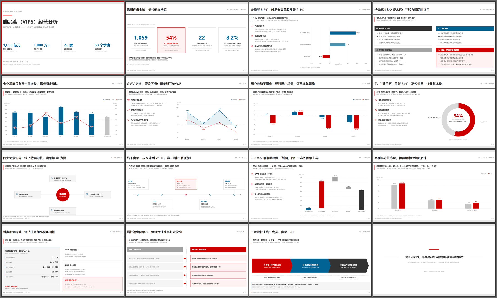
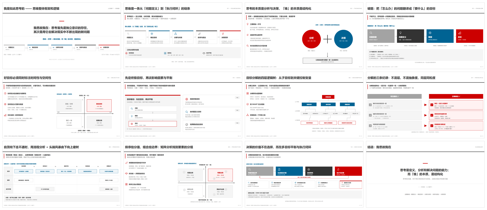
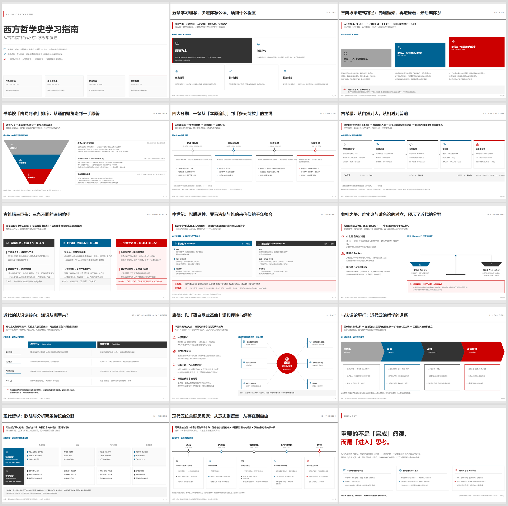

# consulting-html-ppt

用国际顶级咨询公司（McKinsey / BCG / Bain / Deloitte / IBM Consulting）的汇报风格，把一段文字 / 报告 / 文章提炼成 **16:9 高清 HTML 演示页**（1920×1080，纯白 + Flat Design），输出为**一个可直接用浏览器打开的单文件 HTML deck**。

> 这是一份**独立的 Agent Skill**（与 `html-ppt` 等技能无关），遵循通用的 `SKILL.md` 技能规范，可在 CodeBuddy Code / Claude Code / Codex 等支持 Agent Skills 的工具中安装使用。

---

## 效果预览

以下 3 份成品都在 `examples/` 里（点击可打开 HTML 源文件，浏览器直接放映、`←/→` 翻页）。

**① 数据页为主 · 唯品会（VIPS）经营分析（16 页，ECharts 真实图表）**

[](examples/01-经营分析-ECharts.html)

**② 图形页为主 · 我是如此思考的（12 页，SVG 结构模型 + 文本分类版式）**

[](examples/02-思维框架-SVG.html)

**③ 图形页 + 文本分类页 · 西方哲学史学习指南（15 页）**

[](examples/03-哲学史-SVG.html)

> 参考输入：`examples/唯品会经营分析报告.txt`、`examples/我是如此思考的思维整体框架和逻辑.md`。

---

## 它做什么

- **三形态自动判定**：有数值 → ECharts 真实图表；有结构关系 → SVG 结构模型；只有并列类目 → 「线 + 框」文本分类版式。优先级：数据页 ＞ 图形页 ＞ 文本分类页。
- **强制模板化**：所有图形 / 图型必须从技能自带的两个模板库中选取（不许自创），只替换文字与数值。
- **硬性坐标骨架**：20px 边距 / y=170 处 5px 纯黑分隔线拉通全宽 / 标题 48px 加粗 / 内容区 175–1060。
- **咨询级视觉规范**：纯白背景、Flat Design（无渐变/阴影/3D）、全页红色只有一处、图形居中、图标取代序号。
- 附带 **35 个单色线稿图标** 与 **3 份完整参考成品**。

## 目录结构

```
consulting-html-ppt/
├── SKILL.md                      # 技能入口（操作手册 · 决策骨架 · 资源地图）
├── README.md                     # 本文件（安装与使用）
├── references/
│   └── spec.md                   # 完整硬性规范（坐标骨架/模板目录/投放口径/ECharts 坑/质检清单）
├── assets/
│   ├── 图表模板库.html            # 模板库 A：示意结构图形 01–22 + 文本分类版式 23–27（内联 SVG）
│   ├── echarts图表模板.html       # 模板库 B：数据图表 01–28（ECharts 5.5，c01()…c28()）
│   ├── echarts图表模板_缩览图.png  # 模板库 B 的图表缩览
│   ├── echarts.min.js            # 离线用 ECharts（CDN 不可用时替换）
│   └── icons.svg                 # 35 个单色线稿图标精灵（<symbol id="i-xxx">）
└── examples/
    ├── 01-经营分析-ECharts.html   # 数据页为主（唯品会经营分析：ECharts + 内联图标 + 翻页脚本）
    ├── 02-思维框架-SVG.html       # 图形页为主（我是如此思考的）
    ├── 03-哲学史-SVG.html         # 图形页 + 文本分类页（西方哲学史学习指南）
    ├── *_缩览图.png               # 上述 3 份成品的缩览图（README 预览用）
    ├── 唯品会经营分析报告.txt      # 输入示例（→ 01）
    └── 我是如此思考的思维整体框架和逻辑.md  # 输入示例（→ 02）
```

---

## 安装

技能包就是一个含 `SKILL.md` 的目录，把它放进你所用的工具的 **skills 目录**即可。

### CodeBuddy Code

```bash
# 用户级（全项目可用）
cp -r consulting-html-ppt ~/.codebuddy/skills/

# 或项目级（随仓库共享）
mkdir -p .codebuddy/skills && cp -r consulting-html-ppt .codebuddy/skills/
```

### Claude Code

```bash
# 用户级
cp -r consulting-html-ppt ~/.claude/skills/

# 或项目级
mkdir -p .claude/skills && cp -r consulting-html-ppt .claude/skills/
```

### Codex（及其他 Agent Skills 工具）

把 `consulting-html-ppt/` 目录放入该工具配置的 skills 目录（Codex 各版本目录可能不同，以其官方 Skills 文档为准；常见为用户级 `~/.codex/` 下的 skills 目录或项目级 settings 指定目录）。`SKILL.md` 采用标准 frontmatter（`name` + `description`），无需改动即可被识别。

> 若工具没有 Skills 机制，也可直接把 `SKILL.md` 内容作为系统提示 / 项目规则（如 `AGENTS.md`、`CLAUDE.md`）引用，并保留 `references/` 与 `assets/` 的相对路径。

### Windows PowerShell

```powershell
Copy-Item -Recurse consulting-html-ppt "$env:USERPROFILE\.codebuddy\skills\"
```

---

## 使用

安装后，直接用自然语言提出需求即可，技能会被自动识别：

- 「把这份报告做成一份咨询风格的 PPT」
- 「用麦肯锡风格做一个 15 页的经营分析 deck，数据用图表」
- 「帮我把这篇文章提炼成 HTML 演示页，要求 1920×1080、纯白 Flat」

生成流程（技能内部按序执行）：

1. 读内容 → 列页面大纲（每页一句**动作式结论标题**）
2. 逐页做**三形态判定** → 定版式 → 定模板编号
3. 从 `assets/` 两个模板库**照抄** SVG 骨架 / ECharts option，替换文字与数值
4. 拼成单文件 HTML deck（居中缩放 + 键盘翻页 + 圆点跳转 + 页码）
5. 过质检清单（`references/spec.md` 第十一节），不达标即返工

产物是一个 HTML 文件，**直接用浏览器打开**即可放映；`←/→` 翻页，URL 加 `?all` 可一次渲染全部页面（供打印 / PDF / 无头截图）。

---

## 离线说明

- **图形页 / 文本分类页**：完全离线，纯内联 SVG + 系统字体。
- **数据页**：默认从公网 CDN 加载 ECharts 5.5。需要离线时，把模板里的
  `<script src="https://cdn.jsdelivr.net/npm/echarts@5.5.1/dist/echarts.min.js">` 换成本技能自带的 `assets/echarts.min.js`（生成时把该文件复制到产物同目录并改相对路径即可）。

## 分发 / 打包

```bash
# 生成可分发压缩包
cd skills && zip -r consulting-html-ppt.zip consulting-html-ppt
```

压缩包内保留完整目录结构，解压到目标工具的 skills 目录即可。
